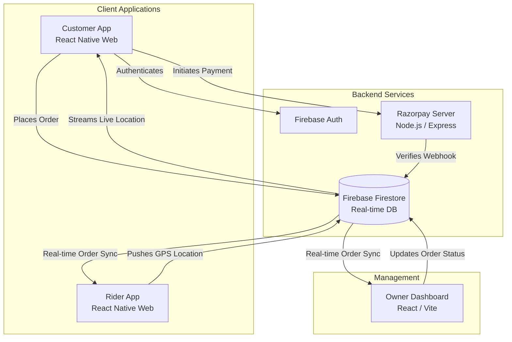

<div align="center">
  

  <a href="https://github.com/Appology-Inc">
    
  </a>

  <p align="center">
    
    
    
    
  </p>

  <p align="center">
    
    
    
    
    
    
  </p>
</div>

<hr />

## 📖 Table of Contents
- [Overview](#-overview)
- [Monorepo Structure](#-monorepo-structure)
- [System Architecture](#-system-architecture)
- [The Applications Showcase](#-the-applications-showcase)
- [Core Features](#-core-features)
- [Technology Stack](#-technology-stack)
- [Getting Started](#-getting-started)
- [Contributing](#-contributing)

---

## 🌟 Overview
The **Anjani Ecosystem** is a complete, production-ready suite of applications designed to modernize restaurant operations from end to end. Built by **Appology Inc**, this monorepo houses everything required to run a high-volume restaurant: from a cinematic customer ordering experience, to a dedicated rider tracking app, a drag-and-drop owner dashboard, and a highly secure payment verification server.

---

## 📂 Monorepo Structure

Our ecosystem is neatly organized into 4 core pillars. Here is how the workspace is structured:

```text
anjani-restaurant/
├── 🍽 Anjani Restaurant/            # Customer App (Expo / React Native)
│   ├── src/app/                     # Next.js-style File-based Routing
│   ├── src/components/              # Glassmorphic UI Components
│   └── src/utils/                   # Firebase DB & Notification Logic
├── 🛵 Anjani Delivery Partner/      # Rider App (Expo / React Native)
│   ├── src/app/                     # Rider Map & Background Tracker
│   └── src/state/                   # Zustand Global State
├── 📊 Anjani Owner Dashboard/       # Admin Dashboard (React / Vite)
│   ├── src/main.ts                  # Real-Time Kanban Logic & Chart.js
│   └── index.html                   # Entry point
└── 🛡 Anjani Razorpay Server/       # Payment Gateway (Node.js)
    ├── index.js                     # Express Server & Webhook Handler
    └── package.json                 # Dependencies
```

---

## 🏗 System Architecture

The entire ecosystem communicates in real-time through Firebase Cloud Firestore, ensuring that when a customer places an order, the kitchen dashboard updates instantly, and the delivery rider receives a push notification milliseconds later.



---

## 📱 The Applications Showcase

<table align="center" width="100%">
  <tr>
    <td align="center" width="33%">
      <h3>🍽 Customer App</h3>
      <p><i>Cinematic Ordering Experience</i></p>
    </td>
    <td align="center" width="33%">
      <h3>🛵 Rider App</h3>
      <p><i>Live GPS Delivery Portal</i></p>
    </td>
    <td align="center" width="33%">
      <h3>📊 Owner Dashboard</h3>
      <p><i>Mission Control Center</i></p>
    </td>
  </tr>
  <tr>
    <td align="center" valign="top">
      
      <br /><br />
      <p>Users can browse dynamic menus, checkout securely via Razorpay, and track their delivery rider's GPS location live on a map.</p>
      <b>Tech:</b> Expo & React Native Web
    </td>
    <td align="center" valign="top">
      
      <br /><br />
      <p>Riders view assigned orders and broadcast their high-accuracy GPS coordinates in the background directly to the customer.</p>
      <b>Tech:</b> Expo & React Native Web
    </td>
    <td align="center" valign="top">
      
      <br /><br />
      <p>Drag-and-drop Kanban board for order states, real-time Chart.js analytics, and live menu inventory toggling.</p>
      <b>Tech:</b> React 18 & Vite (TypeScript)
    </td>
  </tr>
</table>

<details>
<summary><b>🛡 Click to view Backend Details (Razorpay Server)</b></summary>
<br>
The secure vault handling financial transactions. It runs invisible, lightning-fast Node.js execution to generate secure Razorpay Order IDs, intercept webhooks from the bank, mathematically verify HMAC SHA256 signatures, and securely write successful payments to Firestore.
</details>

---

## ✨ Core Features

| Feature | Description | Apps Involved |
| :--- | :--- | :--- |
| **Real-Time Kanban** | Orders flow instantly from the customer to the kitchen without refreshing the page. | Customer, Dashboard |
| **Live GPS Tracking** | Watch your food arrive on a live map as the rider's coordinates are streamed in real-time. | Customer, Rider |
| **Secure Payments** | End-to-end encrypted checkout flow verified server-side to prevent tampering. | Customer, Backend |
| **Push Notifications** | OS-level alerts and chimes notify the kitchen of incoming orders even if the tab is hidden. | Dashboard, Rider |
| **Dynamic Inventory** | Turn off menu items or close the entire restaurant with one click in the dashboard. | Dashboard, Customer |

---

## 🛠 Technology Stack

### Frontend Ecosystem
- **React Native Web (Expo)** (Customer & Rider Apps)
- **React 18 + Vite** (Owner Dashboard)
- **Zustand** (Global State Management)
- **Expo Location & Maps** (Geolocation Tracking)
- **Chart.js** (Dashboard Analytics)

### Backend & Infrastructure
- **Firebase Firestore** (NoSQL Real-Time Database)
- **Firebase Authentication** (Secure User Login)
- **Firebase Hosting** (Edge-cached CDN Delivery)
- **Node.js + Express** (Razorpay Webhook Server)

---

## 🚀 Getting Started

Follow these steps to run the entire ecosystem on your local machine.

### Prerequisites
- [Node.js](https://nodejs.org/en/) (v18 or higher)
- [Git](https://git-scm.com/)
- A Firebase Project (with Firestore and Auth enabled)

### Installation

1. **Clone the repository:**
   ```bash
   git clone https://github.com/Appology-Inc/anjani-restaurant.git
   cd anjani-restaurant
   ```

2. **Start the Owner Dashboard:**
   ```bash
   cd "Anjani Owner Dashboard"
   npm install
   npm run dev
   ```

3. **Start the Customer App:**
   ```bash
   cd "Anjani Restaurant"
   npm install
   npx expo start -p web
   ```

4. **Start the Payment Backend:**
   ```bash
   cd "Anjani Razorpay Server"
   npm install
   npm run start
   ```

*(Note: You will need to populate the `.env` files in each respective directory with your own Firebase and Razorpay credentials).*

---

## 🛣️ Project Roadmap

We are constantly pushing the limits of what a restaurant application can do. Here is what is coming next:

- [x] **Real-Time Kanban & Map Tracking**
- [x] **Hardware Permission Integration** (Location & Notifications)
- [ ] **🤖 AI Ordering Assistant**: Gemini-powered chatbot for intelligent food recommendations.
- [ ] **🗺️ Turn-by-Turn Navigation**: Mapbox integration for the Rider app.
- [ ] **📈 AI Demand Forecasting**: Predicting inventory needs using historical Firebase data.
- [ ] **📲 Native Mobile Launch**: Compiling iOS (.ipa) and Android (.apk) builds for the App Stores.
- [ ] **🧑‍🍳 Kitchen Display System (KDS)**: Dedicated iPad app for chefs.

---

## 📝 Documentation Standards

This repository adheres to incredibly strict documentation standards to remain 100% "Open-Source Ready".
- **File Headers**: Every file contains a `@file` and `@description` JSDoc header.
- **Function Docs**: All core functions, state stores, and React components are heavily annotated.
- **Inline Logic**: Business logic and state transitions feature conversational inline comments to guide new developers.

---

## 🤝 Contributing & Contributors

We welcome contributions from the community! If you are interested in making this restaurant ecosystem even more robust, please fork the project and submit a PR.

<div align="center">
  <h3>Thanks to our incredible contributors!</h3>
  <a href="https://github.com/Appology-Inc/anjani-restaurant/graphs/contributors">
    
  </a>
</div>

---

<div align="center">
  
  <br/><br/>
  <a href="#"></a>
  <a href="#"></a>
  <a href="#"></a>
  <br/><br/>
  <p>Engineered with ❤️ by <strong>Appology Inc.</strong></p>
  <p><i>Building the future of the web.</i></p>
</div>
