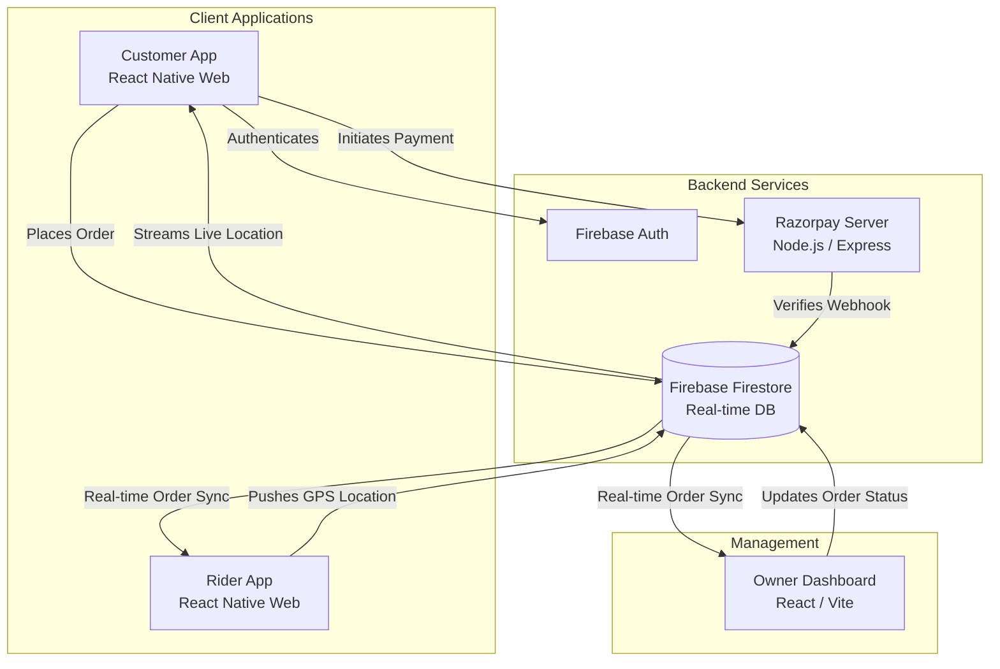

<div align="center">
  
  
  <h1 align="center">Anjani Restaurant Ecosystem 🍔🛵</h1>

  <p align="center">
    <strong>A next-generation, cinematic restaurant ordering, delivery, and management platform.</strong>
    <br />
    Engineered for scale, speed, and real-time operations.
  </p>

  <p align="center">
    
    
    
    
    
    
  </p>
</div>

<hr />

## 📖 Table of Contents
- [Overview](#-overview)
- [System Architecture](#-system-architecture)
- [The Applications](#-the-applications)
- [Core Features](#-core-features)
- [Technology Stack](#-technology-stack)
- [Getting Started](#-getting-started)
- [Documentation Standards](#-documentation-standards)
- [Contributing](#-contributing)
- [License](#-license)

---

## 🌟 Overview
The **Anjani Ecosystem** is a complete, production-ready suite of applications designed to modernize restaurant operations from end to end. Built by **Appology Inc**, this monorepo houses everything required to run a high-volume restaurant: from a cinematic customer ordering experience, to a dedicated rider tracking app, a drag-and-drop owner dashboard, and a highly secure payment verification server.

---

## 🏗 System Architecture

The entire ecosystem communicates in real-time through Firebase Cloud Firestore, ensuring that when a customer places an order, the kitchen dashboard updates instantly, and the delivery rider receives a push notification milliseconds later.



---

## 📱 The Applications

This repository is structured as a monorepo containing four massive pillars:

### 1. 🍽 Customer App (`/Anjani Restaurant`)
A stunning, cinematic web application built on **Expo & React Native Web**. 
- **Experience**: Cinematic splash screens, smooth animations, and a dark-themed, glassmorphic UI.
- **Functionality**: Users can browse dynamic menus, add items to a persistent cart, checkout securely via Razorpay, and track their delivery rider's GPS location live on a map.

### 2. 🛵 Rider App (`/Anjani Delivery Partner`)
A dedicated portal specifically engineered for delivery drivers.
- **Experience**: High-contrast, easy-to-read UI optimized for outdoor visibility.
- **Functionality**: Riders log in securely, view orders assigned to them, and broadcast their high-accuracy GPS coordinates in the background directly to the customer.

### 3. 📊 Owner Dashboard (`/Anjani Owner Dashboard`)
The mission control center for the restaurant owner. Built for desktop web using **Vite & React (TypeScript)**.
- **Experience**: A sleek, professional admin interface.
- **Functionality**: Drag-and-drop Kanban board to manage order states (Incoming -> Preparing -> Ready -> Out), real-time Chart.js analytics (Revenue, Top Items, Peak Hours), and live menu inventory toggling.

### 4. 🛡 Razorpay Backend Server (`/Anjani Razorpay Server`)
The secure vault handling financial transactions.
- **Experience**: Invisible, lightning-fast Node.js execution.
- **Functionality**: Generates secure Razorpay Order IDs, intercepts webhooks from the bank, mathematically verifies HMAC SHA256 signatures, and securely writes successful payments to Firestore using the Firebase Admin SDK.

---

## ✨ Core Features

| Feature | Description | Apps Involved |
| :--- | :--- | :--- |
| **Real-Time Kanban** | Orders flow instantly from the customer to the kitchen without refreshing the page. | Customer, Dashboard |
| **Live GPS Tracking** | Watch your food arrive on a live map as the rider's coordinates are streamed in real-time. | Customer, Rider |
| **Secure Payments** | End-to-end encrypted checkout flow verified server-side to prevent tampering. | Customer, Backend |
| **Push Notifications** | OS-level alerts and chimes notify the kitchen of incoming orders even if the tab is hidden. | Dashboard, Rider |
| **Dynamic Inventory** | Turn off menu items or close the entire restaurant with one click in the dashboard. | Dashboard, Customer |

---

## 🛠 Technology Stack

### Frontend Ecosystem
- **React Native Web (Expo)** (Customer & Rider Apps)
- **React 18 + Vite** (Owner Dashboard)
- **Zustand** (Global State Management)
- **Expo Location & Maps** (Geolocation Tracking)
- **Chart.js** (Dashboard Analytics)

### Backend & Infrastructure
- **Firebase Firestore** (NoSQL Real-Time Database)
- **Firebase Authentication** (Secure User Login)
- **Firebase Hosting** (Edge-cached CDN Delivery)
- **Node.js + Express** (Razorpay Webhook Server)

---

## 🚀 Getting Started

Follow these steps to run the entire ecosystem on your local machine.

### Prerequisites
- [Node.js](https://nodejs.org/en/) (v18 or higher)
- [Git](https://git-scm.com/)
- A Firebase Project (with Firestore and Auth enabled)

### Installation

1. **Clone the repository:**
   ```bash
   git clone https://github.com/Appology-Inc/anjani-restaurant.git
   cd anjani-restaurant
   ```

2. **Start the Owner Dashboard:**
   ```bash
   cd "Anjani Owner Dashboard"
   npm install
   npm run dev
   ```

3. **Start the Customer App:**
   ```bash
   cd "Anjani Restaurant"
   npm install
   npx expo start -p web
   ```

4. **Start the Payment Backend:**
   ```bash
   cd "Anjani Razorpay Server"
   npm install
   npm run start
   ```

*(Note: You will need to populate the `.env` files in each respective directory with your own Firebase and Razorpay credentials).*

---

## 📝 Documentation Standards

This repository adheres to incredibly strict documentation standards to remain 100% "Open-Source Ready".
- **File Headers**: Every file contains a `@file` and `@description` JSDoc header.
- **Function Docs**: All core functions, state stores, and React components are heavily annotated.
- **Inline Logic**: Business logic and state transitions feature conversational inline comments to guide new developers.

---

## 🤝 Contributing
We welcome contributions from the community! If you are interested in making this restaurant ecosystem even more robust:
1. Fork the Project.
2. Create your Feature Branch (`git checkout -b feature/AmazingFeature`).
3. Ensure your code matches our strict documentation and commenting guidelines.
4. Commit your Changes (`git commit -m 'Add some AmazingFeature'`).
5. Push to the Branch (`git push origin feature/AmazingFeature`).
6. Open a Pull Request.

---

<div align="center">
  <p>Engineered with ❤️ by <strong>Appology Inc.</strong></p>
  <p><i>Building the future of the web.</i></p>
</div>
